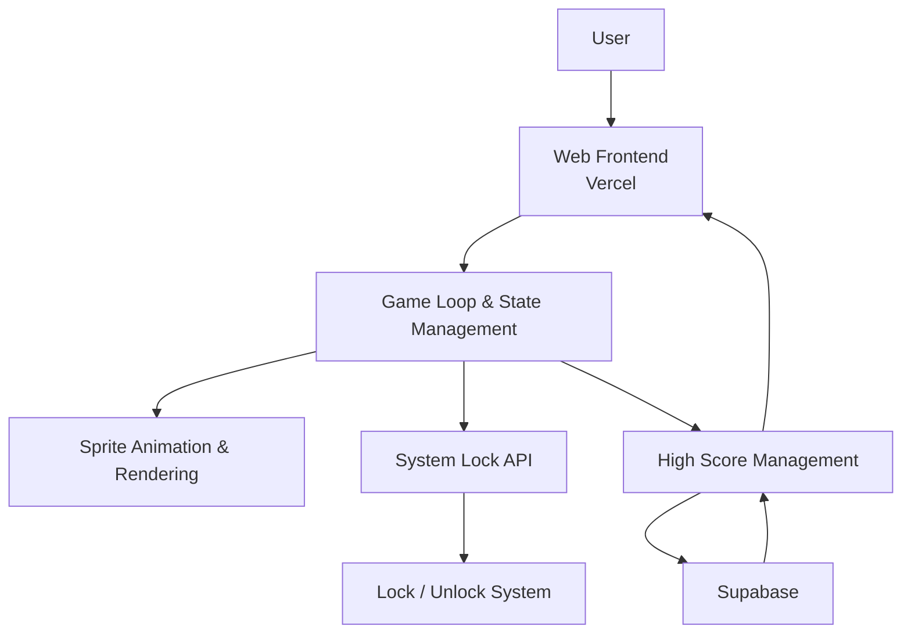

# Demon-Gatchi 🎯

## Basic Details
### Team Name: Avanthika Sreejith

### Team Members
- Team Lead: Avanthika Sreejith - [College]

### Project Description
Demon-Gatchi is a high-friction retro desktop virtual pet game where players must keep an aggressive demon alive by managing its stats. Failing to keep the demon happy triggers an inescapable OS-lock sequence on your system.

### The Problem (that doesn't exist)
Modern operating systems are too forgiving, and standard virtual pets lack real-world personal consequences when neglected.

### The Solution (that nobody asked for)
A needy digital monster that holds your entire computer hostage, enforcing strict survival mechanics paired with a global arcade leaderboard to publicly archive your failures.

## Technical Details
### Technologies/Components Used
For Software:
- JavaScript (ES6+), HTML5, CSS3
- Supabase JS Client (`@supabase/supabase-js`)
- Node.js, Git

### Implementation
For Software:
# Installation
npm install
# Run
npm start

### Project Documentation
For Software:

# Screenshots (Add at least 3)

Demon egg stage which hatches on tap

A cute demon pet appears with doom meter increasing. It can be fed, pet and distracted to bring down the meter. 

The final rage form. Beware of the demon!

# Diagrams

*Application architecture showing the web frontend deployed on Vercel, managing game loop state, rendering sprite animations, sending system lock API commands, and syncing high scores directly with Supabase via anonymous REST calls.*

### Project Demo
# Video
https://drive.google.com/drive/folders/1OahRZktsMaWty1QosHnnSPbPCVDmoNPq?usp=drive_link

*Demonstrates game startup and tapping the dormant egg to hatch a cute demon pet. Highlights game controls (Feed, Pet, Distract) alongside difficulty settings and the rising Doom percentage meter. Showcases the pet's final Rage Mode—where petting backfires to add extra Doom—followed by high score submission to the Supabase leaderboard right before the OS-lock sequence triggers.*

## Team Contributions
- Avanthika Sreejith: Designed full-stack web application architecture, integrated Supabase database for arcade leaderboards, built dynamic multi-stage pet asset loading, wrote interactive UI styling, and configured web deployment pipelines for Vercel.

---
Made with ❤️ at TinkerHub Useless Projects 

